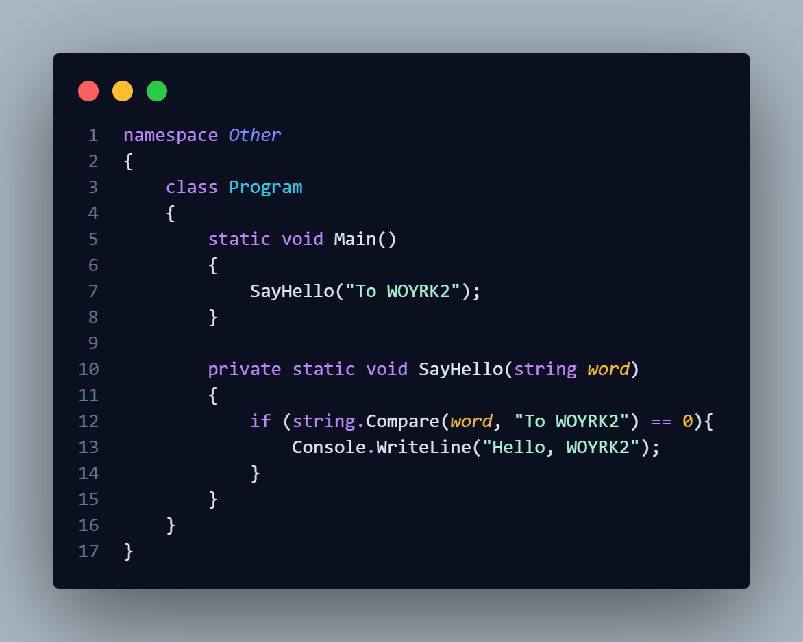

<!-- Картинка по центру -->

  

 

<!-- Языки программирования -->

  <h3>🛠️ Языки программирования</h3>

  
    🐍 Python
  

  
    ⚙️ C++
  

  
    🔷 C#
  

 

<!-- Операционные системы -->

  <h3>💻 Операционные системы</h3>

  
    🪟 Windows
  

  
    🐧 Linux
  

